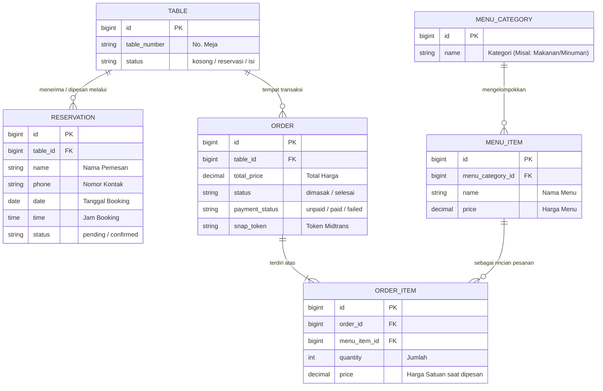

# SIM-C - Sistem Informasi Manajemen Cafe

<div align="center">
  
  
  
  
  
</div>

<br>

**SIM-C (Sistem Informasi Manajemen Cafe)** adalah platform digital berbasis web yang dirancang khusus untuk memodernisasi operasional cafe atau restoran. Sistem ini menghubungkan antarmuka pemesanan mandiri oleh pelanggan (seperti reservasi meja dan order pesanan) dengan panel administrasi *backend* untuk memantau transaksi secara *real-time*. Aplikasi ini mengutamakan kecepatan layanan, akurasi pesanan di dapur, dan juga kemudahan rekapitulasi pembayaran otomatis guna menghindari kebocoran finansial kasir.

---

## Tujuan Pengembangan

Proyek ini dikembangkan dengan tujuan untuk mendigitalisasi proses bisnis F&B (Food and Beverage), mengubah sistem konvensional (catat kertas) menjadi serba terpusat oleh sistem. Dengan SIM-C, diharapkan cafe dapat:
1. Meminimalisir kesalahan pesanan (*human error*) melalui pemesanan digital langsung dari meja.
2. Mempercepat alur pembayaran dengan integrasi QRIS / Transfer Bank secara otomatis.
3. Memastikan manajemen meja yang tertata rapi melalui sistem reservasi yang terotomatisasi.
4. Memudahkan pemilik usaha (Admin) dalam memanajemen stok menu, konten promosi, hingga pelacakan omset secara langsung.

---

## Fitur Utama Sistem

1. Pelanggan dapat melihat menu, memesan, dan langsung melakukan proses *checkout*.
2. Mendukung berbagai metode pembayaran instan (QRIS, GoPay, Virtual Account) dengan pembaruan status pembayaran otomatis (*paid/unpaid*).
3. Formulir reservasi (*booking*) meja yang cerdas. Status meja akan otomatis berubah menjadi "reservasi" atau "isi" saat digunakan untuk mencegah *double-booking*.
4. Manajemen aliran pesanan dengan indikator pelacakan status makanan (misalnya: status *"dimasak"* hingga *"selesai"*).
5. Panel kontrol dengan fungsionalitas CRUD penuh untuk manajemen Menu, Kategori, Meja, Pesanan, Reservasi, hingga Chef dan Testimoni pelanggan.
6. Tampilan depan (beranda) dikelola secara dinamis lewat database, termasuk pengaturan *Hero Slider*, informasi *About*, daftar *Chef*, dan *Featured Events*.

---

## Teknologi dan Komponen

Proyek ini dibangun di atas tumpukan teknologi modern untuk memastikan performa, skalabilitas, dan keamanan:

- **Framework Backend:** Laravel 12 (PHP ^8.2)
- **Framework Admin Panel:** Filament PHP v3 (TALL Stack)
- **Database:** MySQL
- **Frontend & Styling:** Tailwind CSS v4, Vite, Blade Templating
- **Payment Gateway:** Midtrans (Midtrans-PHP API)
- **Arsitektur:** Model-View-Controller (MVC) Pattern

---

## Skema Relasi Database (ERD)

Struktur data aplikasi ini terdiri dari beberapa entitas utama yang saling berelasi. Berikut adalah pemetaan *Entity-Relationship Diagram (ERD)* yang mendasari sistem manajemen cafe ini:



---

## Panduan Instalasi (Development Environment)

Untuk menguji dan menjalankan aplikasi di komputer lokal (localhost), pastikan Anda telah memasang **PHP (versi 8.4)**, **Composer**, **Node.js / NPM**, dan server database seperti **XAMPP / Laragon**.

### 1. Kloning Repositori
Buka terminal dan jalankan perintah berikut untuk mengunduh source code:
```bash
git clone https://github.com/KhairulFikri05/ProjekPBW.git
cd ProjekPBW
```

### 2. Instalasi Dependensi (Backend & Frontend)
Gunakan Composer dan NPM untuk menginstal semua modul (termasuk Laravel, Filament, dll):
```bash
composer install
npm install
```

### 3. Konfigurasi Environment & Midtrans
Salin file `.env.example` menjadi `.env`:
```bash
cp .env.example .env
```
Buka file `.env`, atur koneksi Database Anda, dan pastikan Anda memasukkan *Server Key* Midtrans Anda:
```ini
DB_CONNECTION=mysql
DB_HOST=127.0.0.1
DB_PORT=3306
DB_DATABASE=sim_c
DB_USERNAME=root
DB_PASSWORD=

# Konfigurasi Midtrans
MIDTRANS_SERVER_KEY=SB-Mid-server-xxxxxxxxx
MIDTRANS_CLIENT_KEY=SB-Mid-client-xxxxxxxxx
MIDTRANS_IS_PRODUCTION=false
```

### 4. *Generate Application Key*
Buat kunci enkripsi keamanan aplikasi:
```bash
php artisan key:generate
```

### 5. Migrasi dan Seeding Data Uji
Jalankan perintah ini untuk membuat semua tabel ke dalam database MySQL secara otomatis:
```bash
php artisan migrate:fresh --seed
```

### 6. Kompilasi Aset & Jalankan Server
Kompilasi CSS/JS dan nyalakan web server internal Laravel. direkomendasikan menggunakan perintah serentak (jika tersedia):
```bash
npm run build
php artisan serve
```
Aplikasi siap diakses melalui browser pada: `http://127.0.0.1:8000`  
Untuk mengakses Panel Admin Filament: `http://127.0.0.1:8000/admin`

---

## Dokumentasi (Screenshots)

### 1. Halaman Beranda & Katalog Menu
<p align="center">
  
</p>

### 2. Modul Checkout & Pembayaran (Midtrans)
<p align="center">
  
</p>

### 3. Dasbor Admin (Filament PHP)
<p align="center">
  
</p>

---

## Profil Pengembang

Program SIM-C ini dikembangkan oleh **Kelompok 10** untuk memenuhi tugas UAS Pemrograman Berbasis Web

### Anggota Tim (Kelompok 10)
* **Khairul Fikri**
* **Rijaluddin Abdul Ghani**
* **Muhammad Riskan Rajabi**
* **Reyan Andrea**

> Dibuat sambil ditemani secangkir kopi, dedikasi, dan kerja sama tim menggunakan Laravel 12.
